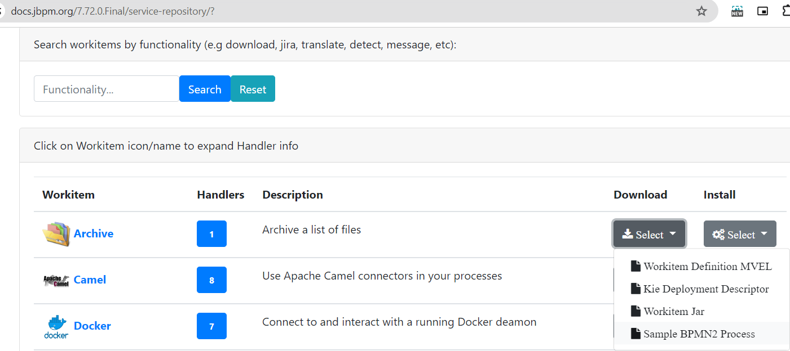

Business App Initial Content
=============================

This app is created using kie-service-spring-boot-archetype (https://www.jbpm.org/businessapps/gettingStarted.html)
also spring version and kie version upgraded
```
mvn archetype:generate -B -DarchetypeGroupId=org.kie -DarchetypeArtifactId=kie-service-spring-boot-archetype -DarchetypeVersion=7.52.0.Final -DgroupId=com.tsm -DartifactId=tsm-service -Dversion=1.0-SNAPSHOT -Dpackage=com.tsm.service -DappType=bpm
```
## Getting started with JBPMN

https://www.jbpm.org/learn/gettingStartedUsingSingleZipDistribution.html

### Download jBPM 7.74.1.Final server (single zip) distribution
Just download, unzip and run

On Unix/Linux:
`jbpm-server/bin/standalone.sh`

On Windows:
`jbpm-server\bin\standalone.bat`

### Generating backend apps and getting started
https://www.jbpm.org/businessapps/gettingStarted.html

### Documentation (opensource jbpmn):
https://docs.jbpm.org/7.74.1.Final/jbpm-docs/html_single/

https://www.jbpm.org/learn/documentation.html

### Execution Server REST API
https://www.jbpm.org/api-docs/kie-server/overview.html
https://www.jbpm.org/api-docs/kie-server/paths.html
https://www.jbpm.org/api-docs/kie-server/definitions.html

### Controller REST API
https://www.jbpm.org/api-docs/controller/overview.html
https://www.jbpm.org/api-docs/controller/paths.html
https://www.jbpm.org/api-docs/controller/definitions.html

### Docker imager:
https://www.jbpm.org/learn/gettingStartedUsingDocker.html
```
docker run -p 8080:8080 -p 8001:8001 -d --name jbpm-server-full jboss/jbpm-server-full:latest
```

### Examples:
https://download.jboss.org/jbpm/release/7.74.1.Final/jbpm-7.74.1.Final-examples.zip

- jbpm-examples -> [jbpm-7.74.1.Final-examples](https://github.com/tsmahur/jbpm-7.74.1.Final-examples)
- Sample project in business central are also available.
  `JBPMN Space > project > Try Sample`
---
## Installing RedHat Jbpmn:
- Using the Red Hat Process Automation Manager installer
  - https://access.redhat.com/documentation/en-us/red_hat_process_automation_manager/7.1/html-single/installing_and_configuring_red_hat_process_automation_manager_on_red_hat_jboss_eap_7.1/index#roles-users-con
    - Using the installer in interactive mode:
      ```
      java -jar rhpam-installer-7.1.0.jar
      //use below to avoid administrator credentials
      java -Dizpack.mode=privileged -jar rhpam-installer-7.1.0.jar
      ```
- Installing Red Hat Process Automation Manager from ZIP files :
  - https://access.redhat.com/documentation/en-us/red_hat_process_automation_manager/7.1/html-single/installing_and_configuring_red_hat_process_automation_manager_on_red_hat_jboss_eap_7.1/index#assembly_installing-on-eap-deployable

--------------------
# JBPMN : Spring Boot : Java Implementations:
## Custom EventListener: 
- CustomTaskEventListner [CustomTaskEventListner](src/main/java/com/tsm/eventlisteners/CustomTaskEventListener.java)
- CustomProcessEventListner [CustomProcessEventListner](src/main/java/com/tsm/eventlisteners/CustomProcessEventListner.java)

## Custom WorkItemHandler:
- Some Pre Defined Custom WorkItems (found these under service-tasks folder by extracting business-central.war from standalone/deployment folder):  
  - https://docs.jbpm.org/7.72.0.Final/service-repository/
  - `workitem definitation`,`deployment descriptor`,`actual jar`,`sample bpmn showcasing use` are avaible on this website
  
    - jbpm-workitems-email : https://docs.jbpm.org/7.72.0.Final/service-repository/jbpm-workitems-email/jbpm-workitems-email.wid
      <pre>
      [
        [
            "name" : "Email",
            "displayName" : "Email",
            "category" : "jbpm-workitems-email",
            "description" : "",
            "defaultHandler" : "mvel: new org.jbpm.process.workitem.email.EmailWorkItemHandler()",
            "documentation" : "jbpm-workitems-email/index.html",

            "parameters" : [
                                "Reply-To" : new StringDataType()
                ,"Cc" : new StringDataType()
                ,"Bcc" : new StringDataType()
                ,"From" : new StringDataType()
                ,"To" : new StringDataType()
                ,"Body" : new StringDataType()
                ,"Attachments" : new StringDataType()
                ,"Subject" : new StringDataType()
                ,"Debug" : new StringDataType()
                ,"Template" : new StringDataType()

            ],
            "mavenDependencies" : [
                                 "org.jbpm:jbpm-workitems-email:7.72.0.Final"

            ],
            "icon" : "defaultemailicon.png"
        ]
      ]
      // Also refer "jbpm-workitems-email" dependency for reference to packaging workitem jar 
      // and actual java code behind this workitem {Refer below point}
      </pre>
  - To refer code of any predefined custom workitem : https://github.com/kiegroup/jbpm-work-items/tree/main
    - eg. ArchiveWorkItemHandler.java : https://github.com/kiegroup/jbpm-work-items/blob/main/archive-workitem/src/main/java/org/jbpm/process/workitem/archive/ArchiveWorkItemHandler.java
- CustomWorkItemHandler
- CustomEmailWorkItemHandler
- CustomRestWorkItemHandler

<u>Adding Custom Work Item Handler to JBPMN and defining it in java:</u>
 1. create custom [workitemhandler](src/main/java/com/tsm/workitemhandler)
 2. add config in workDefinations.wid 
  ```
    //sample config (can refer default workDefinations.wid in project):

	[
		"name": "TestWorkItemHandler",
		"displayName": "TestWorkltemHandler",
		"category": "jbpm-workitems-mycustom-tsm-test",
		"description": "",
		"defaultHandler": "mvel:com.tsm.workitemhandler.CustomWorkItemHandler()",
		//"defaultHandler" : "mvel: new com.tsm.workitemhandler.CustomWorkItemHandler()",
		// "documentation": "jbpm-workitems-rest/index.html",
		"icon": "defaultservicenodeicon.png",
		"parameters": [
			"ConnectTimeout": new StringDataType(),
			"ResultClass": new StringDataType(),
			"ContentType": new StringDataType(),
			"AcceptCharset": new StringDataType(),
			"Headers": new StringDataType(),
			"AuthUrl": new StringDataType(),
			"Method": new StringDataType(),
			"ReadTimeout": new StringDataType(),
			"Url": new StringDataType(),
			"ContentTypeCharset": new StringDataType(),
			"HandleResponseErrors": new StringDataType(),
			"ContentData": new StringDataType(),
			"Username": new StringDataType(),
			"Content": new String DataType(),
			"AcceptHeader": new StringDataType(),
			"AuthType": new StringDataType(),
			"Password": new StringDataType()
		],
		"results": [
			"Result": new StringDataType()
		]
	]
   ```
	
 3. `JBPMN > settings > deployment > workitemhanlder`
   - Now add : <br >
       - Name -> this name will be referred in the bpmn
       - Value -> new [com.tsm.workitemhandler.CustomWorkItemHandler()](src/main/java/com/tsm/workitemhandler/CustomWorkItemHandler.java) //here we can also call parameterized constructor defined in custom workitem handler
       - Resolver Type -> MVEL
   - Now go to `bpmn editor > Left Side Pallet > CustomTasks Icon > now above task will be available here `

##  CustomUserGroupCall :